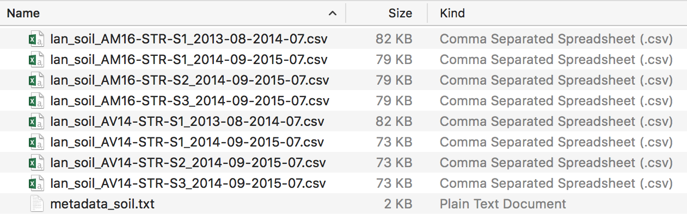

```{r setup, include=FALSE}
knitr::opts_chunk$set(echo = TRUE)
```

## Tools for formatting, cleaning, merging, and assembling microclimate data

Data from microclimate sensors is often fairly simple in structure (csv formatted text files with dates, times, and measurements). Annoyingly, however, different sensor models, software versions, system settings, and research protocols create small differences in the formatting of the files that make them difficult to process efficiently, especially when combining data from several different studies, as I did for the [MORAclim project](http://tinyplant.org/blog/2016/07/22/MORAclim-intro/).

To simplify and accelerate this process, I've developed [a set of R functions](https://github.com/ibreckhe/HRL_microclimate) that streamlines formatting, cleaning, and summarizing of microclimate data. Currently, the code is fairly specific to the sensor types and protocols that we use in the [HRL lab](https://faculty.washington.edu/jhrl/Index.html) (Onset HOBO and OneWire iButton sensors), but the general strategy might be helpful for other groups that deal with this sort of data a lot. Eventually, we might put this together into an R package, but for now, it's just a set of (relatively sparsely documented) functions available in a [public GitHub repository](https://github.com/ibreckhe/HRL_microclimate). In this post, I'll run through basic usage of the tools and explain a little bit of what's going on under the hood.

I want to acknowledge that this effort builds on the work of other HRL lab scientists, including Kevin Ford and Steve Kroiss.

## Overview

The tools fall into six categories: formatting, cleaning, merging, summarising, assembly and plotting. 

* The data formatting tool (``format_micro_csv()``) can be used to bring data from different sensor types into a common and consistent format that can be easily cleaned. 

* The data cleaning tools (``clean_air_temps()`` and ``clean_soil_temps()``) take files that are in this common format and remove problematic values that likely represent errors. The functions also identify and attempt to correct potential problems in the data such as mis-specified time zones.

* The data merging tool (``merge_micro_csv()``) merges data from separate files into continuous time-series.

* The data summarising tools (``summarise_airtemp_daily()`` and ``summarise_soiltemp_daily()``) compute daily statistics from the merged time-series.

* The data assembly tools (``compile_airtemp_daily()``, and ``compile_soiltemp_daily()``) combine daily time-series from many sites into a single file that is ready for analysis.

* The data plotting tool (``alignment_plot()``) creates time-series plots of assembled data.

The data formatting, merging, and plotting tools can be used on multiple data types (i.e. air temperature and soil temperature), but the data cleaning, summarising, and assembly tools are specific to the type of measurement that the sensor is taking. This is because the different measurement types tend to have different types of problems, different ranges of reasonable values, and require different daily summaries. 

## Usage example

In this example, I'll take you through a basic workflow that I use to clean and consolidate data for my own work using these functions. To follow along, download or clone this repository to your own machine and open up the `HRL_microclim_example.R` document in Rstudio or your IDE of choice.

First we'll have to set the workspace, source the script that contains the workhorse functions, and load a few packages that are required for the underlying functions to work. 

To run this on your own machine, you will need to change the path specified by ``project_dir`` in the code block below to the correct folder on your machine.

```{r workspace, eval=FALSE}
####Set up workspace####
project_dir <- "~/code/HRL_microclimate/"
setwd(project_dir)
source("./code/HRL_microclim_functions.R")

require(data.table)
require(xts)
require(psych)
```

Next let's take a look at how the data is structured. I'm processing two different types of files: measurements of air temperature, and measurements of soil surface temperature, for two different years, 2014 and 2015. The input folder and file structure looks like this: 


The data is in four different folders representing files downloaded from the different types of sensors in the two different years. I'm going to start with the soil temperature measurements, which come from HOBO pendant data loggers located on the soil surface.

## Formatting data

The first task is to take these files and consolidate them into a common format. This is done by using the function `batch_format_micro_csv()`. This function takes a set of folders (technically a character vector of file paths), and processes all of the files in those folders that have a `.csv` extension. In this example, we've got two paths that represent soil measurements from two different years.

```{r paths, eval=FALSE}
input_paths_soil <- paste(project_dir,c("data/test_data/soil_2014/","data/test_data/soil_2015/"),
                          sep="")
```

Note that these need to be *absolute paths*, so I am pasting together the project directory with the subdirectories containing the files. Also, the functions will check to make sure that the specified input and output paths already exist. In this example, I've already created empty directories to hold output and temporary files.

Next we set up the rest of the arguments to the function:

```{r csv processing1, eval=FALSE}
soil_formatted <- format_micro_csv(input_paths=input_paths_soil,
                                   output_path=paste(project_dir,"temp/soil",sep=""),
                                   file_prefixes=c("Ian_soil","Ian_soil"),
                                   output_metadata_filename="metadata_soil.txt",overwrite=TRUE)
```

The `output_path` argument sets the folder where the formatted files will be written, the `file_prefixes` argument defines the character string that will be appended to the beginning of the files from each folder. This is useful for identifying files from a particular study. Finally, the `output_metadata_filename` argument sets the name of the file where summary statistics will be written about each of the files that is processed. If the argument `overwrite` is `FALSE`, then the function will skip writing formatted files if they already exist.

After running this function, new files appear in the output folder (`/temp/soil`)



These files now have names that contain some more information. The first part of the name, `Ian_air`, is the prefix we specified in the function. The middle part, `AM16-STR-S1`,is the name of the original file. The last part `2013-08-2014-07' represents the month and year of the first and last measurements, respectively. This helps prevent the script from overwriting data from files that share the same name, but contain data from different spans of time.

The function also creates an output file (in this case `metadata_soil.csv`) with additional information about each of the files that were processed, including the number of measurements, the logging interval (in hours), the minimum and maximum values recorded, and some guesses about the time zone of the measurements and which type of sensor collected the data. This information is extracted from the file header, if it is available.

If you want to examine this metadata from within R, just save the function call to a new variable (like `snow_formatted` as in the example above).

## Cleaning and checking the data

Now that we have put all of the files into a consistent format, we can clean the soil temperature data using the function ``clean_soil_temps()``. This process removes values that are outside the plausible range of measurements, and spikes that probably represent sensor errors, and data from days with near-constant temperatures near 24C, which probably represent laboratory conditions. The function also looks for and attempts to correct possible problems with the time index of the data, including mis-specified time zones, and missing AM/PM information.


```{r soil cleaning, eval=FALSE}
clean_soil_temps(input_path=paste(project_dir,"temp/soil",sep=""),
                input_metadata_filename="metadata_soil.txt",
                output_path=paste(project_dir,"output/soil",sep=""),
                output_metadata_filename="metadata_flags_soil.txt",
                figure_path=paste(project_dir,"figs/soil",sep=""),
                guess_tz="Etc/GMT-7",temp_spike_thresh=20,
                min_temp_thresh=-20,max_temp_thresh=60,max_temp_hr=17,
                cf_test_params=c(40,160,20,30),
                overwrite=TRUE)
```

The function takes a folder path containing formatted files as input, along with a metadata file created by ``format_micro_csv()``. It outputs cleaned data in two folders added to the output path ``flagged`` and ``unflagged``. The ``unflagged`` folder contains data that has passed all the data quality checks, and the ``flagged`` folder contains files that have remaining problems that could not be corrected by the cleaning function. The function also creates plots of each cleaned data file. It's always a good idea to review all of these plots and make sure that all of the data looks reasonable. 

The cleaning functions address several different types of common problems in microclimate time-series. Here's what they do:

*1. Remove unphysical values.* Low battery or fluctuations in voltage can cause erroneous data to be recorded to memory, often stored as extremely high or extremely low temperatures. This function removes all measurements that are below `min_temp_thresh` or above `max_temp_thresh`.

*2. Remove sudden temperature spikes.* If the sensor gets direct sun because of a problem with radiation shielding, this will often manifest as a sudden spike in temperatures. The function looks for these sudden changes and removes measurements that are right after increases larger than `temp_spike_thresh`.

*3. Detect and correct C/F problems.* If sensors mistakenly are set to record temperatures in Fahrenheit instead of Celcius, then the resulting files have particular unusual ranges of minimum and maximum temperatures. The function detects these problems, and converts the data to Celcius. The argument `cf_test_params` controls the 4 temperature thresholds used in these tests. Measurements are likely in Fahrenheit if the maximum temperature is greater than [1], the maximum temperature is less than [2], the minimum temperature is greater than [3] and the mean temperature is greater than [4].

*4. Remove lab-based measurements* Sometimes sensors start recording before they are deployed in the field, or continue to record once they are brought back to the lab. The cleaning functions look for days with constant temperatures near the typical lab conditions of 24C and remove measurements from those days. The function also removes data from one day preceding and following these lab days, with the assumption that they reprsent the days in which the sensor was deployed.

*5. Detects and corrects possible time-zone problems.* The function measures the average time of day of maximum temperatures, and flags files where that time of day is more than two hours different from `max_temp_hr`. In temperate North America, this maximum typically falls in the late afternoon (hour 17, or 5:00pm).

This function has several options that control how the data is cleaned. The option ``guess_tz`` assigns time-zone information to the data if it could not be extracted from the header of the raw file. The options ``min_temp_thresh`` and ``max_temp_thresh`` control the minimum and maximum temperatures that are considered valid measurements. The option ``temp_spike_thresh`` controls the maximum measurement-to-measurement change that is considered valid, with temperature spikes greater than the threshold removed from the data. The option ``max_temp_hr`` is the expected hour of maximum temperatures during the day. These options work well for our data, but may need to be modified in other regions.

## Extracting snow variables.
Once we've got cleaned data, we are ready to extract summary information from the files. In this case, I'm particularly interested in extracting information on the seasonal timing of snow melt for each site. We've got a dedicated function for this `extract_snow_summaries()`. This function loops through each of the input files, runs a series of additional checks, and then extracts information about snow cover in each of the files. Here's the syntax for our example

```{r snow summaries, eval=FALSE}
snow_summaries <- extract_snow_summaries(input_path=paste(project_dir,"output/soil/clean_unflagged",sep=""),
                        input_metadata_filename=paste(project_dir,"output/soil/metadata_flags_soil.txt",sep=""),
                        output_path=paste(project_dir,"output/soil",sep=""),
                        figure_path=paste(project_dir,"figs/soil",sep=""),
                        output_metadata_filename="metadata_flags_snow.txt",
                        range_threshold=1,max_threshold=2,overwrite=TRUE)
```

Data that passes the series of checks (indicating that there are no known problems with the data), are copied to the output path in a subfolder `unflagged`, while the files that don't pass these tests are copied to a different folder `flagged`. Extracted snow statistics are stored in the file specified by the `output_metadata_filename` argument. The function also creates a series of plots (stored in the `figure_path`) that helps to diagnose problems with the data. 

The snow cover algorithm relies on the insulating properties of snow, which causes soil surface temperature measurements to be constant near zero Celsius, at least in maritime mountain environments with large snowpacks like the Sierra Nevada ([Raleigh et al. 2013](http://www.sciencedirect.com/science/article/pii/S0034425712003768)), and Cascades ([Ford et. al. 2013](http://journals.plos.org/plosone/article?id=10.1371/journal.pone.0065008)). In this algorithm, days with a temperature range less than a specified threshold (1 degree C in the example above), and a maximum temperature less than a specified threshold (2 degrees C in the example above), are considered to be covered by snow. The default thresholds work well for our study sites in Mt. Rainier National Park, but you should review the output to make sure that they are working properly.

The best way we've found to do this is by reviewing the data visually. Here is an example of a plot where the algorithm seems to be performing well. You can see the near-constant temperatures recorded when the soil surface is covered by snow (indicated by red dots), and the algorithm detects these days well (indicated by blue dots at the top of the plot).


The most important output of this function is the output metadata file (`metadata_snow.txt`), which has summary statistics for each of the files that passes the data quality checks, including the first date with snow, the last date with snow, the number of days of snow cover, and the minimum soil temperature recorded in the file. The function also returns this metadata, so if you store it in a variable (as in the example above), you can then process it further from within R.

## Merging time-series together.

Often we would like to create continuous time-series from a bunch of files that were collected from the same site at different times. The function ``merge_micro_csv()`` facilitates doing this for (possibly large) large collections of files. The challenge here is matching up groups of files that all correspond to the same sensor location and merging these files together. Here's how to specify this merge for the test dataset:

```{r soil merge, eval=FALSE}
merge_micro_csv(input_path=paste(project_dir,"output/soil/clean_unflagged",sep=""),
               file_metadata_path=paste(project_dir,"output/soil/metadata_flags_soil.txt",sep=""),
               file_metadata_join_column="filestem",
               sensor_metadata_path=paste(project_dir,"data/test_data/sensor_locations.csv",sep=""),
               sensor_metadata_join_column="combined_name",
               output_path = paste(project_dir,"output/soil/merged_hourly/",sep=""),
               output_metadata_path=paste(project_dir,"output/soil/merged_hourly/metadata.txt",sep=""),
               figure_path=paste(project_dir,"figs/soil/merged_hourly",sep=""),
               hour_begin=as.POSIXct("2014-01-01 00:00 PDT"),
               hour_end=as.POSIXct("2016-08-01 00:00 PDT"),
               tzone="Etc/GMT-7",
               interp_gap_max=8,
               overwrite=TRUE)
```

In this function, the matching of files to sensor locations is done by joining a table of file metadata with a table of known sensor metadata. The columns that link the two tables can be specified in the arguments `file_metadata_join_column` and `sensor_metadata_join_column`. If files are mis-named, it is possible to manually edit the values in `file_metadata_join_column` to correct these errors.

An additional challenge in merging time-series is that measurements in each collection of files can be recorded at different time intervals. This could occur if, for example, soil temperatures were recorded every 4 hours during the winter, but every 2 hours in the summer. The ``merge_micro_csv()`` function deals with this issue by interpolating each time-series so that it has one measurement at the beginning of each hour. The arguments ``hour_begin`` and ``hour_end`` control the minimum and maximum date and time of the merged time-series, the argument ``tzone`` controls the time-zone of the output time-series, and the argument ``interp_gap_max`` controls the maximum number of hours without a measurement that can be filled using interpolation.

## Creating daily summaries.

Once files are merged together into continuous time-series, we can compute daily summary information. The function ``summarise_soiltemp_daily()`` does this for soil temperature time-series, computing minimum and maximum temperatures, along with estimated snow cover for each day.

```{r soil summarise, eval=FALSE}
summarise_soiltemp_daily(input_path=paste(project_dir,"output/soil/merged_hourly",sep=""),
                 output_path=paste(project_dir,"output/soil/summarised_daily",sep=""),
                 snow_range_thresh=1,
                 snow_maxt_thresh=2,
                 overwrite=TRUE)
```

This function uses the same algorithm as ``extract_snow_summaries()`` to assess whether the sensor is covered by snow on each day. The function has two options: ``snow_range_thresh`` controls the maximum diurnal temperature range considered snow covered, and ``snow_maxt_thresh`` controls the maximum daily temperature that is considered snow covered.

## Assembling daily summaries.

Once we've got cleaned and standardized daily time-series for each site, it's straightforward to combine them into a single dataset for analysis. The ``compile_soiltemp_daily()`` function does this for soil temperature measurements.

```{r soil compile, eval=FALSE}
soiltemp_data <- compile_soiltemp_daily(input_path=paste(project_dir,"output/soil/summarised_daily",sep=""),
                   output_file_snow=paste(project_dir,"output/soil/merged_daily_2014_2015_snow.csv",sep=""),
                   output_file_tmin=paste(project_dir,"output/soil/merged_daily_2014_2015_smin.csv",sep=""),
                   output_file_tmax=paste(project_dir,"output/soil/merged_daily_2014_2015_smax.csv",sep=""),
                   start_date=as.Date("2014-09-01"),
                   end_date=as.Date("2015-09-15"),
                   add_summer_zero=TRUE,
                   overwrite=TRUE,
                   return_data=TRUE)
```

The function outputs three files that contain daily time-series for the three types of daily summaries relevant to soil temperature data: minimum temperatures, maximum temperatures, and snow cover. The arguments ``start_date`` and ``end_date`` control the first and last days of measurements that are included in the combined data. If the option ``add_summer_zero = TRUE``, then zero measurements are substituted for missing data between September 1st, and September 30th, a period that rarely has any snow cover in most environments. If the argument ``return_data=TRUE`, then the function returns a list containing the three data frames of output data, in addition to writing data to disk.

## Visualizing assembled time-series.

The last step in the process of cleaning and formatting data is visualizing all of the time-series together so that outliers and mismatched data become easier to detect. The ``alignment_plot()`` function creates a custom time-series plot for all the columns in a data frame. Running this function on one of the data frames output by by ``compile_soiltemp_daily()`` shows our final assembled time-series.

```{r soil plot, eval=FALSE}
alignment_plot(data_df=soiltemp_data$tmin,
               year_seq=2014:2015,
               min_month="01-01",
               max_month="12-31",
               min_y=-5,max_y=15,
               col_subset="all",
               ID_text=FALSE)
```


## Processing air temperature data.

The procedure for processing air temperature data is similar to that of soil temperature, except we will use a different dedicated function for data cleaning, `clean_air_temps()` that has specific checks and outputs relevant to air temperature, as well as different functions for summarising and assembling the summarised data. Here's the whole procedure:

```{r air temp processing,eval=FALSE}
##Paths of folders to process (all must be absolute paths)
input_folders_air <- paste(project_dir,c("data/test_data/air_2014/","data/test_data/air_2015/"),
                           sep="")

##Gets files in a common format.
format_micro_csv(input_paths=input_folders_air,
                       output_path=paste(project_dir,"temp/air",sep=""),
                       file_prefixes=c("Ian_air","Ian_air"),
                       output_metadata_filename="metadata_air.txt",overwrite=TRUE)

##Remove spikes and unphysical values.
clean_air_temps(input_path=paste(project_dir,"temp/air",sep=""),
               input_metadata_filename="metadata_air.txt",
               output_path=paste(project_dir,"output/air",sep=""),
               output_metadata_filename="metadata_flags_air.txt",
               figure_path=paste(project_dir,"figs/air",sep=""),
               guess_tz="Etc/GMT-7",temp_spike_thresh=10,
               min_temp_thresh=-20,max_temp_thresh=50,max_temp_hr=17,
               cf_test_params=c(40,100,-5,20),
               overwrite=TRUE)

##Merges time-series for known sensor locations.
merge_micro_csv(input_path=paste(project_dir,"output/air/clean_unflagged",sep=""),
        file_metadata_path=paste(project_dir,"output/air/metadata_flags_air.txt",sep=""),
        file_metadata_join_column="filestem",
        sensor_metadata_path=paste(project_dir,"data/test_data/sensor_locations.csv",sep=""),
        sensor_metadata_join_column="combined_name",
        output_path = paste(project_dir,"output/air/merged_hourly/",sep=""),
        output_metadata_path=paste(project_dir,"output/air/merged_hourly/metadata.txt",sep=""),
        figure_path=paste(project_dir,"figs/air/merged_hourly",sep=""),
        hour_begin=as.POSIXct("2013-01-01 00:00 PDT"),
        hour_end=as.POSIXct("2015-08-01 00:00 PDT"),
        tzone="Etc/GMT-7",
        interp_gap_max=6,
        overwrite=TRUE)

summarise_airtemp_daily(input_path=paste(project_dir,"output/air/merged_hourly",sep=""),
                         output_path=paste(project_dir,"output/air/summarised_daily",sep=""),
                         overwrite=FALSE)

airtemp_data <- compile_airtemp_daily(input_path=paste(project_dir,"output/air/summarised_daily",sep=""),
                 output_file_tavg=paste(project_dir,"output/air/merged_daily_2014_2015_tavg.csv",sep=""),
                 output_file_tmin=paste(project_dir,"output/air/merged_daily_2014_2015_tmin.csv",sep=""),
                 output_file_tmax=paste(project_dir,"output/air/merged_daily_2014_2015_tmax.csv",sep=""),
                 start_date=as.Date("2014-09-01"),
                 end_date=as.Date("2015-09-15"),
                 overwrite=TRUE,
                 return_data=TRUE)

##Plots time-series to check alignment.
alignment_plot(data_df=airtemp_data$tmin,
               year_seq=2014:2015,
               min_month="01-01",
               max_month="12-31",
               min_y=-10,max_y=20,
               col_subset="all",
               ID_text=FALSE)
```

## Other tips for successful data processing.

This simple example shows the typical usage of the microclimate data processing scripts, and also models some best-practices for working with this data. Here are a few other tips that have helped me:

*1. Do not move the original files.* It is easy to accidentally overwrite files with similar names if you change the folder structure. This script works with data in it's original folders, and outputs compiled data to a temporary location.

*2. Do not modify the files in Microsoft Excel.* Although it's convenient to open these files in Excel or another spreadsheet program, my experience is that modifying them in Excel (and saving the changes) causes all kinds of problems with dates and column header formatting. This is particularly true for files that have dates and times stored together, such as the cleaned time-series used here.

*3. Always review plots of the data.* The automated checks in these functions are useful for identifying common potential problems in the data, but are unlikely to catch every conceivable kind of problem. There is really no substitute for examining the data visually, and these data cleaning functions output sets of plots that can be used for this purpose.